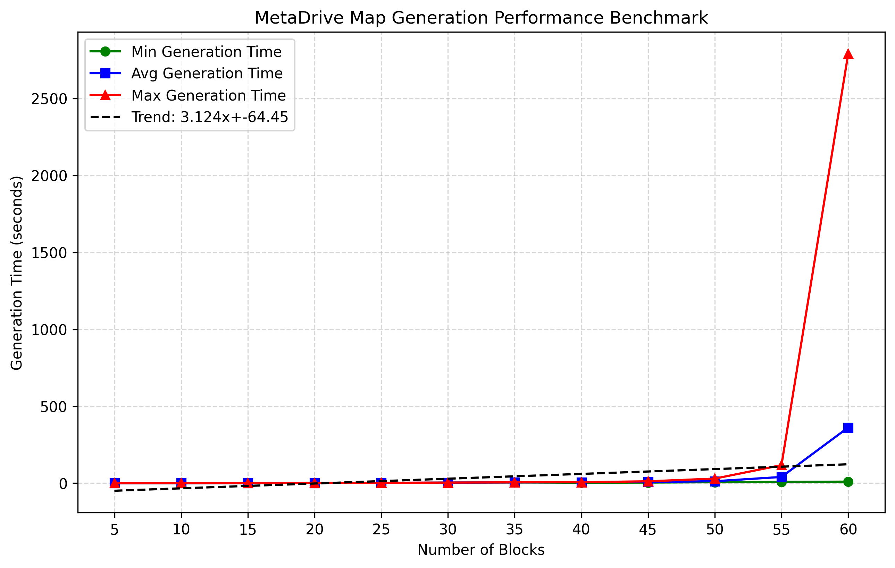
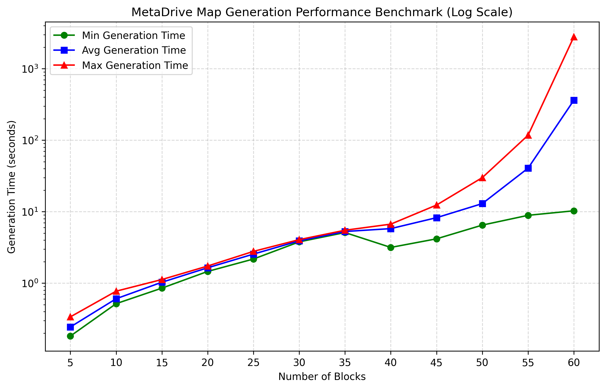
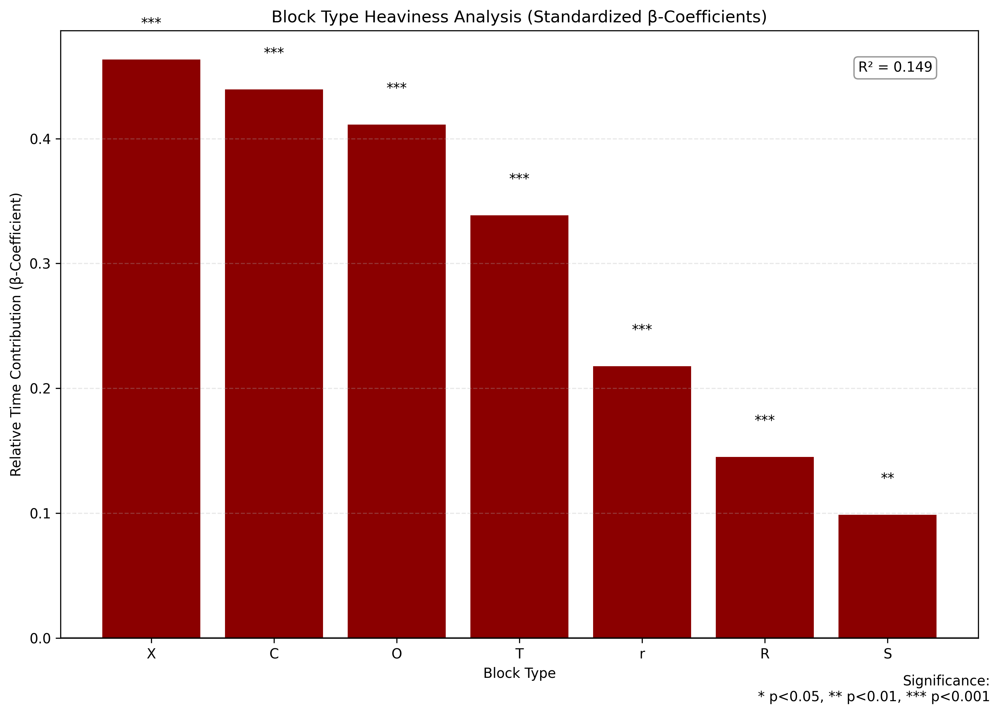
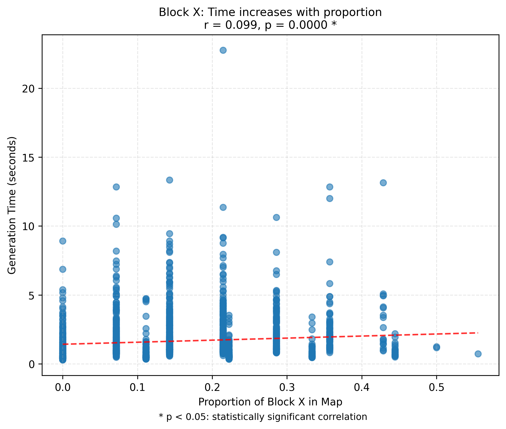
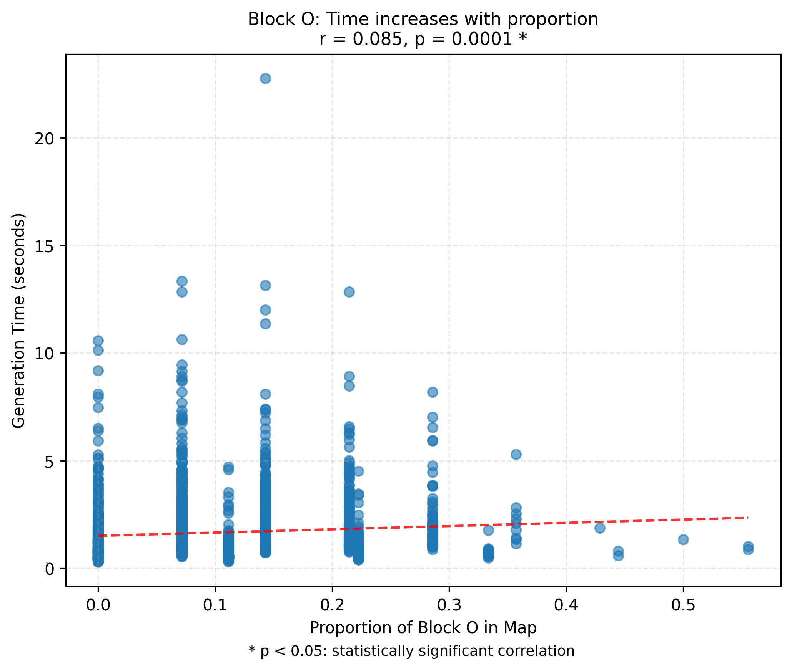
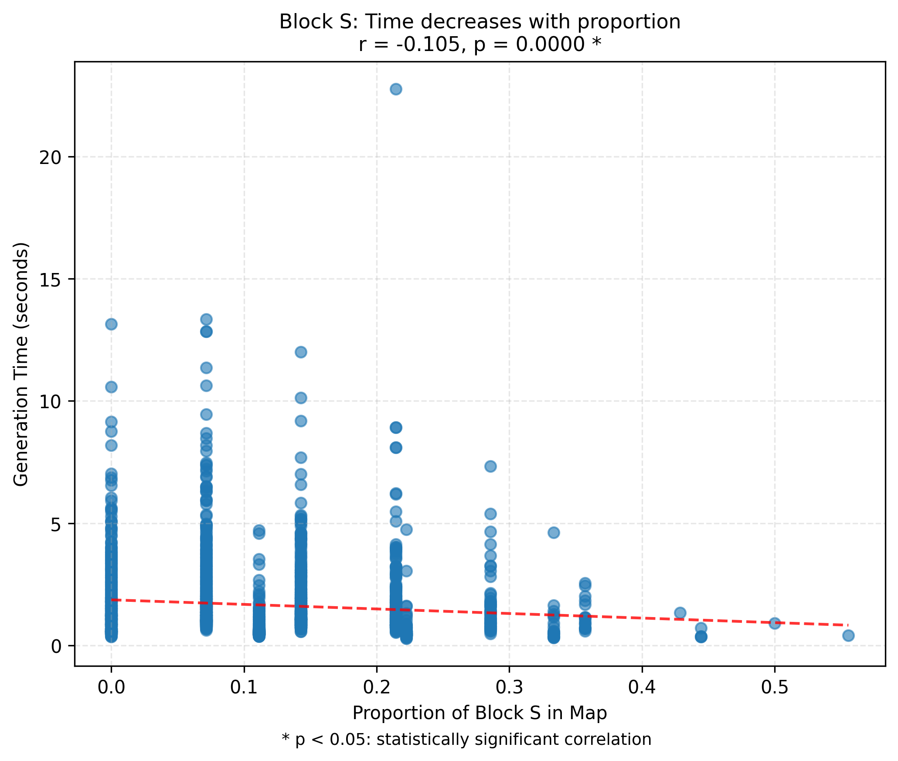
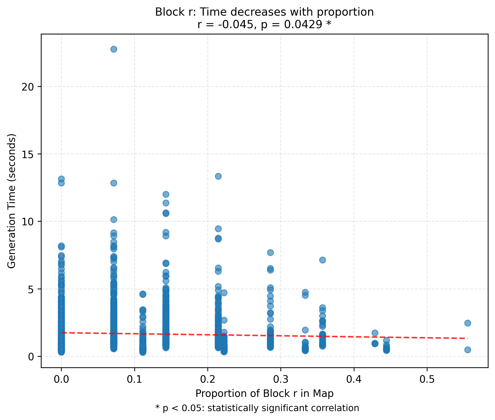

# Summer Internship Pre-assignment

## Table of Contents
- [How I Approach the Problem](#how-i-approach-the-problem)
- [What is a Good Map](#what-is-a-good-map)
- [Planning](#planning)
- [Experiments](#experiments)
- [Conclusion](#conclusion)
- [Limitation](#limitation)
- [Future Work](#future-work)
- [References](#references)

## How I Approach the Problem

### Framing the Assignment
I interpreted this assignment not merely as a map-generation task, but as a test scenario generation task for Autonomous Driving Systems (ADS). Initially, based on the prompt (“If you want, consider the task from an autonomous vehicle testing perspective”), I started to view each **map** as a **test scenario**. To validate this framing, I referred to _Zhong et al. (2021)_, which defines **scenario-based testing** as a layered abstraction (L1–L5).

This led me to reinterpret my task more precisely: I am performing **vehicle testing** within the context of **L1 scenario variation**, treating MetaDrive as a tool to generate road topology diversity for testing ADS.

Furthurmore, Given that MetaDrive was explicitly specified in the assignment, I examined [a recent study co-authored by Donghwan Shin, the professor of this internship (Osikowicz et al., 2025)](https://philmcminn.com/publications/osikowicz2025.pdf), to understand the rationale behind this choice.

### Identifying the Role of MetaDrive
- The study found that 31.3% of benchmark scenarios in CARLA were flaky due to simulation nondeterminism, whereas MetaDrive yielded **no flaky tests under the same evaluation protocol** (Osikowicz et al., 2025, p. 1).
- This finding indicates that MetaDrive supports deterministic simulation and ensures reproducibility, an essential requirement in system-level ADS testing.
- Given this, I interpreted the use of MetaDrive in the assignment as a deliberate decision to avoid flaky behaviours and to align with the research direction suggested by the previous study.

## What is a Good Map

To answer what makes a good test scenario for evaluating an ADS, I refer to the scenario abstraction model proposed by Zhong et al. (2021). They define a 5-layer structure for scenarios, which helps organise reasoning about scenario design:
- **Layer 1**: road geometry and topology (e.g., curvature, number of lanes, surface)
- **Layer 2–5**: concerns infrastructure, manipulations, agent behaviour, and environment

In this framework, map generation occurs at Layer 1, which forms the static foundation of any scenario. However, L1-level variation alone does not constitute a complete test scenario(Zhong et al., 2021, p. 6). This indicates that **map information (L1)** is only part of a broader composition and must be combined with dynamic elements from higher layers to form a scenario that can be used for testing.

Although L1 diversity is not sufficient, it provides the foundation for generating a variety of them. Thus, a good map makes it possible to create diverse and meaningful scenarios
### Mapping Layer 1 to MetaDrive's Map Generation
To operationalise the L1 scenario layer defined by Zhong et al. (2021)—which includes features such as road curvature, ramps, network size, and junction types—I mapped a subset of L1 elements to MetaDrive’s configurable map generation components.

In particular, I interpret **block_num** in MetaDrive as a proxy for **road network size**, one of the key attributes of Layer 1. A higher block count results in a larger, more complex road graph, potentially introducing more intersections, curves, and topological variability.

By adjusting the number of blocks (`block_num`) in MetaDrive while keeping all other configurations fixed, I aim to incrementally increase map complexity and collect statistics on the **distribution of block types** generated per map.

| MetaDrive Component      | Mapped L1 Feature                     | Description                                                |
| ------------------------ | ------------------------------------- | ---------------------------------------------------------- |
| `block_num`              | Road network size                     | Controls overall map size; proxy for network structure     |
| `block_type`             | Road curvature, ramps, junction types | Encodes topological features like curves and intersections |
| `lane_num`, `lane_width` | Number and geometry of lanes          | Configures lane-level structure for each road segment      |

This mapping serves as the basis for my experiment, where I use `block_num` to systematically induce variation in L1-level road structure
## Planning
The goal of this assignment is to collect and analyze metrics for maps generated by MetaDrive. In particular, it is important to examine the correlation between generation time and map structure based on user input.

But this raises the question: "**Why do we need to analyze the generation time?**" Is this just a technical issue, or does it have research implications?

#### Refine the Problem

MetaDrive provides seed-based procedural map generation. This allows experimenters to experiment iteratively by automatically generating a variety of maps, making scenario-based testing flaky (Osikowicz et al., 2025).

However, researchers need to create complex maps to achieve the desired scenario diversity. Example: Long paths, varying curvature, complex intersections, etc.

The problem is, as the complexity increases, it is expected that the generation time is likely to increase as well. For example, generating a map with 20 or more different blocks will require more computation, which can be a bottleneck if we want to automatically generate thousands of maps.

Therefore, generation time becomes an important factor that limits how complex the scenarios can be while still keeping the simulation fast enough.

### Research Objectives
In this assignment, I aim to reveal the following trade-off structure

  1. **Map diversity (coverage, structural complexity)** ↑ → **Generation time** ↑.
Generation time vs block count
  2. The impact of specific block types (e.g., roundabout, ramp) on generation time
  3. How different block combinations can affect the generation time

These experiments aim to provide **guidelines for designing simulation experiments**. By allowing researchers to choose the right diversity within their desired time budget, they can optimize simulation efficiency × scenario coverage.
## Experiments
Random map generation in MetaDrive follows a built-in probabilistic distribution. Each block type serves a distinct structural role in the map:

| Block Type        | ID  | Description                     | Probability |
| ----------------- | --- | ------------------------------- | ----------- |
| Curve             | C   | Curved road segment             | 0.3         |
| Straight          | S   | Straight road segment           | 0.1         |
| InRampOnStraight  | r   | On-ramp (entrance to highway)   | 0.1         |
| OutRampOnStraight | R   | Off-ramp (exit from highway)    | 0.1         |
| StdInterSection   | X   | Standard 4-way intersection     | 0.15        |
| StdTInterSection  | T   | Standard T-intersection (3-way) | 0.15        |
| Roundabout        | O   | Circular intersection           | 0.1         |
| FirstPGBlock      | I   | Initial block (starting point)  | N/A         |
### Basic: Generation Time Vs Block Count
This experiment provides a simple yet informative baseline for assessing the effect of **increasing block_num** on **generation time** in MetaDrive.

The following directories contain the analysis scripts and output data:
- `analysis/blockscale_benchmark`
- `outputs/blockscale_benchmark`

To understand both overall scaling trends and bottleneck behaviour, two parallel visualisation strategies were used:
- **Linear Scale**
    - Provides an intuitive view of mean/min/max generation time across block counts
    - Clearly reveals a **bottleneck region** with a sharp time increase (e.g., block_num 50–60)
    - Useful for identifying absolute cost trends and runtime thresholds
- **Log Scale**
    - Amplifies the early-stage time differences that are compressed on a linear scale
    - Highlights fine-grained variance and outliers in the **low block count range (5–30)**
    - Enables detailed analysis of **pre-bottleneck** runtime dynamics

#### Setup
- `block_num` was varied from 5 to 60 in increments of 5 (12 levels in total)
- Generation time statistics (mean, min, max, and standard deviation) were computed via the `blockscale_benchmark.py` for each block_num level
- Results were saved in both `.json` and `.csv` formats for each block count
    - Maps were generated for each specified block_num, and their corresponding performance data were stored in structured `.json` and `.csv` files
    - These files were later imported by the analysis script, normalised based on the mean, and visualised accordingly

#### Result
<table>
  <tr>
    <td></td>
    <td></td>
  </tr>
</table>

- Overall, average generation time increased with block_num
- Growth was gradual in early phases but showed a **sharp non-linear increase beyond a threshold**
    - avg: 60 blocks → ~362 seconds
    - max: 60 blocks → ~2789 seconds
- The minimum time remained low throughout, suggesting that **individual block generation is not costly**, and bottlenecks occur due to **failures in block connection sequences**

A simple increase in block_num leads to **linearly increasing cost** at first, but beyond a threshold, the **backtracking-based generation logic** induces **non-linear time explosion**. This is likely due to an increased number of **pathfinding failures and repeated retries** in the internal procedural generation engine. Therefore, block_num acts not merely as a size control parameter, but as a **primary complexity driver** of generation time in MetaDrive

### Generation Time Vs Block Heaviness
This experiment quantitatively analyses how the presence of specific block types in MetaDrive’s procedural map generation affects total generation time.

Although direct manual map composition is possible, this experiment focuses on random map generation, where specifying `block_num` triggers an internal block sampling and connection process beyond direct user control.

The following directories contain the analysis scripts and output data:
- `analysis/block_heaviness`
- `outputs/block_heaviness`

#### Setup
First, these experiments used randomly generated 1550 maps based on a fixed number of blocks (TARGET_BLOCK_COUNT = 15). The "I" block (initial block) is always present and was excluded from the analysis.

For each generated map:

- Block type counts (excluding `"I"`) were normalised by total block count to obtain **block_type_ratios**.
- A **linear regression model** was fitted with `time_elapsed` as the dependent variable and each block type ratio as an independent variables.
    - Model equation: `Y = α + β₁·p_Curve + β₂·p_Ramp + … + ε`
    - Larger β-coefficients indicate that a block type **contributes more heavily to generation time**.
    - Model fitting was performed using `LinearRegression` from scikit-learn.

To compute block heaviness:

- Each block type’s absolute count (e.g., `count_T`, `count_X`) was used as an independent variable.
- Linear regression was applied with `time_elapsed` as the response variable.
- The resulting regression coefficients (β) were interpreted as **heaviness scores**.
    - A larger coefficient implies that the block contributes more significantly to increased generation time.
#### Results
Certain block types (e.g., X, C, O) showed **high heaviness scores**, suggesting that their presence tends to **increase generation time**:

	

- Intersection-related blocks (X, T, O) had the highest coefficients, implying that **structurally complex junctions** are more computationally expensive to generate.
- The curve block (C) also scored significantly higher than the straight block (S), indicating that **curvature layout and connectivity** affect generation logic.

Limitations are that linear regression analysis assumes that block rates have an **independently linear** effect on generation time. Real-world generation process contains non-linear structures such as topological constraints between blocks, backtracking due to connection failures, etc.
### Generation Time Vs Block Ratio
To analyze how the relative composition ratio of each block type in the procedural map generated by MetaDrive statistically affects the overall generation time.

It is necessary to generate multiple maps to observe the relationship between the change in the ratio of each block type and the generation time. The **proportion within the total** may be more important than the actual number of block types.

The following directories contain the analysis scripts and output data:
- `analysis/block_ratio`
- `outputs/block_ratio`
#### Setup
For these experiments randomly generated 1550 maps based on a fixed number of blocks (TARGET_BLOCK_COUNT = 15)

In all maps, the "I"` block (initial block) is always present, so we exclude it from analysis.
- For each scenario:
	- Exclude `"I"` from `block_counts`.
	- Calculate the ratio of each block type based on `total_blocks` (e.g., `ratio_T = count_T / total_blocks`)
- How to analyze:
	- Calculate **Pearson correlation** between each block ratio and `generation time` (`time_elapsed`).
	- Visualize **scatter plot + trend line** using matplotlib
	- Derive the correlation coefficient (`r`) and significance (`p-value`) for each block
	- If the absolute value of the correlation coefficient is large and p < 0.05 → I conclude that the proportion of the block has a statistically significant effect on time

#### Result

<table>
  <tr>
    <td></td>
    <td></td>
  </tr>
  <tr>
    <td></td>
    <td></td>
  </tr>
</table>

- Relationship between proportion of block type and time that is significant based on p-value:
	- `S`: r = -0.105 , ***larger block ratio takes relatively less time***
	- `X`: r = +0.099 , ***larger block ratio take more time***
	- `O`: r = +0.085 , ***larger block ratio increases time***
	- `R`: r = -0.085 , ***larger block ratio takes relatively less time***
	- `r`: r = -0.045 , ***larger block ratio takes relatively less time***
	- `C, T`: not significant (p > 0.05)

- Implications:
	- Higher **X, O** ratio increases generation time → Intersection-centered structure may be a factor in increasing complexity.
	- For **S, R, r**, they are relatively simple or straightforward shapes, so they are likely to form efficient combinations within the same number of blocks.
		- This may contribute to a lower distribution of overall generation time.
- Limitations
	- Pearson correlation analysis based on a single variable does not consider **multiple factor interactions**.
	- Analyzed based on a fixed number of blocks, so it only reveals **relative combination effects** rather than **absolute differences in generation time**.
	- Correlation does not guarantee causation → Example: Unclear if it took longer because of a higher proportion of X, or if maps with more complex structure contain more X

## Conclusion

- Generation time clearly increases as the number of blocks increases → check baseline
- Time difference can be explained by block ratio alone, S, R, r is a relatively efficient combination (ratio analysis)
- Certain blocks (X, C, O) cause time-consuming maps (heaviness analysis)

This experiment shows that it is not just the number of blocks, but also what blocks they are composed of that has a decisive impact on the generation time, i.e., generating complex MAPs for the sake of increasing scenario diversity leads to a resource consumption called execution time, which directly limits the size of the experiment or the number of iterations. Experimenters need to balance the trade-off between simulation efficiency and scenario diversity by designing efficient block combinations within their time budget.

However, since MetaDrive uses a backtracking algorithm to generate a map, in addition to simple block combinations, topology connection failures or road network misconfigurations can be a major cause of increased generation time. In particular, block connection attempts are repeated up to T times, with a fallback procedure to revert to the previous network if all fail. This can cause generation time to spike or appear to be an infinite loop for certain structures. This is stated in the paper as follows.

> "Maximally T trials will be conducted. If all of them fail, we remove the latest block and revert to the previous road network (Line 24)."
> - *Li et al., 2021, MetaDrive: Composing Diverse Driving Scenarios for Generalizable Reinforcement Learning*.

In our current experiments, timeout handling is not explicitly implemented in the logic of the MetaDrive implementation, and it is **difficult to control timeout passively** as the inner loop can block for a long time. This limits the number of blocks that can be experimented with to **65 or less**.
## Limitation

- I tried multithreading-based exception handling to handle timeouts, but it failed due to Python GIL and thread internal exception propagation issues. In the future, handling using native interrupts
- As the number of blocks increases, the probability of connection failures in the backtracking algorithm spikes, causing extreme delays above 65 → This is interpreted as an effect of topological constraints other than simple combinations.
- Both heaviness and ratio analyses used the same seed increment method (linear) and the same dataset. → While they lack complete independence due to overlapping analytical targets, they are designed with separate folders for each experiment to allow for future experiment branching and reuse.
- I linearly increase the seed value when performing benchmarks, but for long-term reproducibility or collision avoidance, a hash-based unique ID design is desirable in the future
## Future Work

This experiment implicitly revealed that in addition to the number and type of blocks, external factors such as **MetaDrive internal algorithms (e.g., backtracking)** affect the generation time. Therefore, in the next step, we can extend the analysis to the **combination effect of structural factors such as block order, lane length, and intersection location**.

In particular, the current structure of linearly increasing the same seed resulted in redundancy between datasets, so future experiments for tasks 2-3 should consider seed diversity.

## References
- Zhong, Z., Tang, Y., Zhou, Y., Neves, V. de O., Liu, Y., & Ray, B. (2021). _A Survey on Scenario-Based Testing for Automated Driving Systems in High-Fidelity Simulation_ (No. arXiv:2112.00964). arXiv. [https://doi.org/10.48550/arXiv.2112.00964](https://doi.org/10.48550/arXiv.2112.00964)
- Osikowicz, O., McMinn, P., & Shin, D. (2025). _Empirically Evaluating Flaky Tests for Autonomous Driving Systems in Simulated Environments_.
- Li, Q., Peng, Z., Feng, L., Zhang, Q., Xue, Z., & Zhou, B. (2021). _MetaDrive: Composing Diverse Driving Scenarios for Generalizable Reinforcement Learning_ (Version 3). arXiv. [https://doi.org/10.48550/ARXIV.2109.12674](https://doi.org/10.48550/ARXIV.2109.12674)
